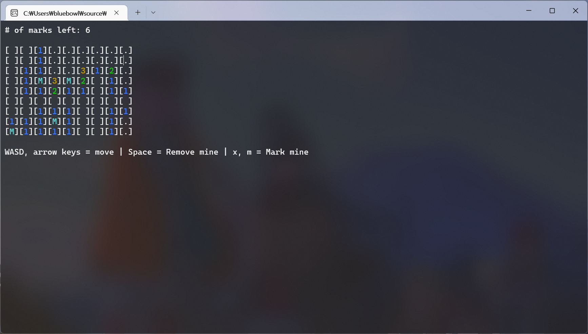

# minesweeper

Simple console minesweeper written in VB.NET. Nothing more.

**NOTE**: Please don't expect a lot, because I wrote this in four hours when I was 16.

## Features
 * a working minesweeper
 * custom board size & # of mines (it's even possible to create a board full of mines!)
